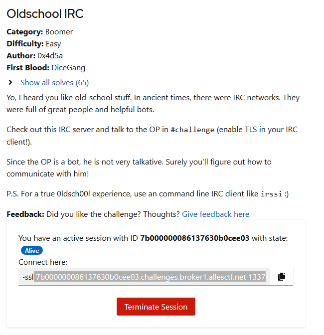
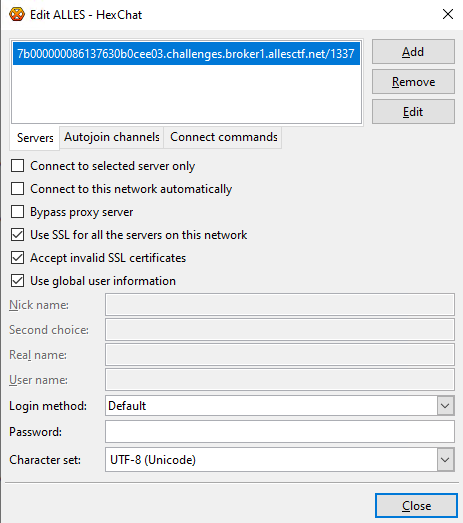
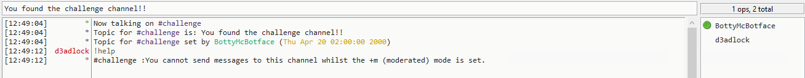
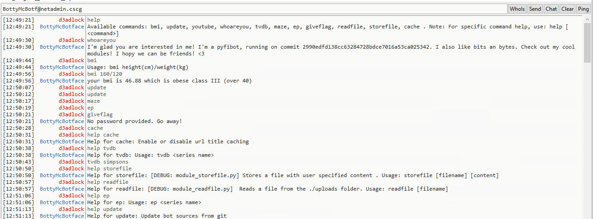
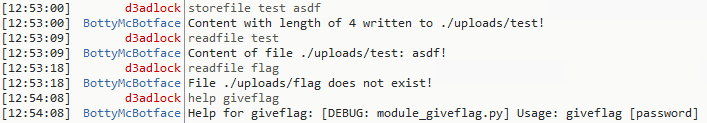
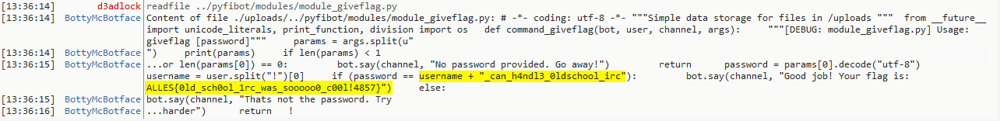
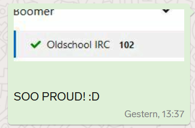

# AllesCTF 2020 - Oldschool IRC

Task Description & Requesting the Session: 



We can connect with e.g. Hexchat to the server which is displayed to us:



Once we are there, we join the #challenge channel and meet BottyMcBotface.



We can't talk to him in the channel, but we can pm him directly for interaction

First thing we do is to see with help, to get a list of commands he offers



The usual semi-helpfull irc bot stuff ... but what's interesting is readfile, storefile and giveflag

````storefile```` allows us to create files in ./upload directory

````readfile```` let's us read those files

and ````giveflag```` obviously should give us the flag if we provide the correct password:



After a bit of messing arround, we notice that we have a directory traversal vulnerability in ````readfile````


Checking out the [github project](https://github.com/lepinkainen/pyfibot) of pyfibot we notice that readfile, storefile and giveflag do not seem to be default functionalities (any more?).

But we observe that the directory structure might be ````pyfibot/modules/module_name.py````. So this should be what we try to get via the readflag directory traversal:



And in the code we find the PW + the Flag:

````ALLES{0ld_sch0ol_1rc_was_sooooo0_c00l!4857}````
 
Notifying the team in threema and recognizing with a look at the timestamp that destiny exists :P

